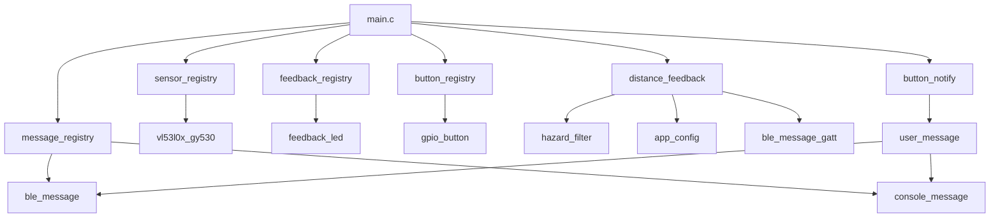

# Прошивка VibroGuide (ESP32-S3)

Устройство ориентирования для незрячих: лазерный дальномер оценивает препятствие впереди, LED/вибромотор сигнализирует **только при сближении**; кнопка отправляет SOS по BLE (или в UART без Bluetooth).

## Архитектура

## Точка входа

`main.c` инициализирует абстракции через реестры, запускает `button_notify_start` (фоновая задача) и блокируется в `distance_feedback_run`.

| Этап | Модуль | Интервал |
|------|--------|----------|
| Опрос ToF + hazard | `distance_feedback` | 200 ms (`APP_HAZARD_SAMPLE_INTERVAL_MS`) |
| UART/BLE телеметрия | `distance_feedback` | 500 ms (`APP_MEASURE_INTERVAL_MS`) |
| Мигание LED | `feedback_output` tick | 5 ms (`APP_FEEDBACK_TICK_MS`) |
| Кнопка | `button_notify` | 10 ms (`APP_BUTTON_POLL_MS`) |

## Документация по модулям

| Каталог | Назначение |
|---------|------------|
| [app_config](app_config/README.md) | Пороги зон и тайминги |
| [distance_sensor](distance_sensor/README.md) | Абстракция дальномера |
| [sensor_registry](sensor_registry/README.md) | Выбор драйвера ToF |
| [hazard_filter](hazard_filter/README.md) | Фильтр «приближение» |
| [distance_feedback](distance_feedback/README.md) | Главный цикл |
| [feedback_output](feedback_output/README.md) | Абстракция индикатора |
| [feedback_registry](feedback_registry/README.md) | Выбор LED/вибро |
| [button_input](button_input/README.md) | Абстракция кнопки |
| [button_registry](button_registry/README.md) | Выбор GPIO-кнопки |
| [button_notify](button_notify/README.md) | SOS по нажатию |
| [user_message](user_message/README.md) | Канал сообщений |
| [message_registry](message_registry/README.md) | BLE vs UART |
| [drivers/vl53l0x_gy530](drivers/vl53l0x_gy530/README.md) | GY-530 / I2C |
| [drivers/feedback_led](drivers/feedback_led/README.md) | GPIO LED |
| [drivers/gpio_button](drivers/gpio_button/README.md) | GPIO кнопка |
| [drivers/ble_message](drivers/ble_message/README.md) | NimBLE GATT |
| [drivers/console_message](drivers/console_message/README.md) | UART fallback |

## Сборка

- **PlatformIO**: `env:freenove_esp32_s3_wroom`, framework `espidf`
- **BLE**: включён в `sdkconfig.defaults` (`CONFIG_BT_NIMBLE_ENABLED`); без него `ble_message` исключается из сборки (`CMakeLists.txt`), активен `console_message`.

## Разводка GPIO (текущая)

| Сигнал | GPIO | Модуль |
|--------|------|--------|
| I2C SDA | 4 | vl53l0x_gy530 |
| I2C SCL | 5 | vl53l0x_gy530 |
| LED | 6 | feedback_led |
| XSHUT | 7 | vl53l0x_gy530 |
| Кнопка | 8 | gpio_button |

Совместимость с Android: `src_android/` (`Constants.kt`, `VibroGuideService.kt`).
