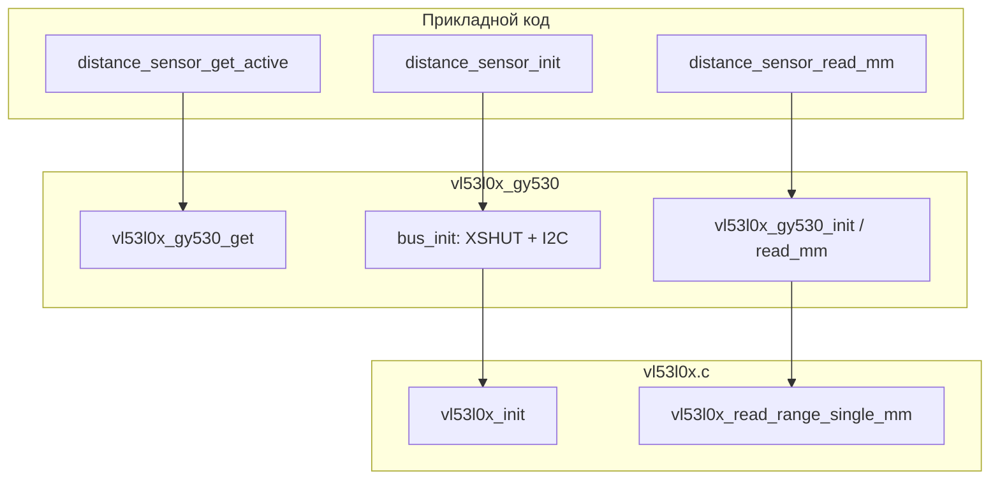

# vl53l0x_gy530

Драйвер модуля **GY-530** (чип **STMicro VL53L0X**) как реализация [distance_sensor](../../distance_sensor/README.md).

Стек из двух слоёв:

| Слой | Файлы | Роль |
|------|-------|------|
| Адаптер платы | `vl53l0x_gy530.c`, `vl53l0x_gy530_config.h` | GPIO XSHUT, шина ESP-IDF `i2c_master`, обёртка `distance_sensor_t` |
| Протокол чипа | `vl53l0x.c`, `vl53l0x.h` | Регистры VL53L0X, калибровка, одиночный замер (порт алгоритма ST VL53L0X API / Pololu) |

Прикладной код не вызывает `vl53l0x_*` напрямую — только `vl53l0x_gy530_get()` и API `distance_sensor`.

---

## Принцип измерения

**Time-of-Flight (ToF)**: импульс лазера 940 nm, измерение времени до отражения → дистанция вдоль **оси модуля** (направление, куда смотрит GY-530 на корпусе).

- Один вызов `read_mm` → один снимок `vl53l0x_read_range_single_mm()`.
- Диапазон чипа: порядка **до ~2 m** (зависит от режима, отражения, освещения).
- Прикладная зона alert ограничена [app_config](../../app_config/README.md) (`zone_max`, по умолчанию 1 m) — это не ограничение драйвера, а фильтра [hazard_filter](../../hazard_filter/README.md).

---

## Архитектура и жизненный цикл



### Синглтон контекста

`vl53l0x_gy530_get()` возвращает указатель на статическую `distance_sensor_t` с `impl = &s_ctx`. Контекст `vl53l0x_gy530_ctx_t` хранит:

- `vl53l0x_t vl53` — хендл I2C-устройства, `stop_variable`, бюджет времени измерения, таймаут ожидания готовности;
- `i2c_master_bus_handle_t bus` — мастер-шина;
- `i2c_master_dev_handle_t i2c_dev` — устройство на адресе `0x29`.

`deinit` не реализован (`NULL`) — шина и GPIO не освобождаются до перезагрузки.

### Последовательность `init`

1. **`bus_init`** (адаптер):
   - XSHUT: LOW → пауза → HIGH → пауза (выход из shutdown, см. константы в `vl53l0x_gy530_config.h`).
   - `i2c_new_master_bus` + `i2c_master_bus_add_device`.
   - `i2c_master_probe` (предупреждение в лог, если нет ACK; init всё равно продолжается).
2. **`vl53l0x_init`** (чип):
   - Проверка Model ID `0xEE`.
   - Режим I/O 2.8 V (типично для GY-530).
   - Чтение `stop_variable`, настройка MSRC, лимита сигнала, SPAD-карты, загрузка tuning, GPIO прерываний, бюджет времени.
   - Две калибровки VHV и phase (`perform_single_ref_calibration`).
3. В `vl53` записываются `i2c` и `io_timeout_ms`.

### Последовательность `read_mm`

1. `vl53l0x_read_range_single_mm()`:
   - Запись `stop_variable` в регистр `0x91` (обязательная преамбула ST API перед стартом).
   - `SYSRANGE_START = 0x01` — одиночное измерение.
   - Ожидание сброса бита «измерение идёт» в `SYSRANGE_START`.
2. `read_range_continuous_mm()`:
   - Ожидание флага готовности в `RESULT_INTERRUPT_STATUS` (маска `0x07`).
   - Чтение дистанции из `RESULT_RANGE_STATUS + 10` (смещение поля range в блоке результата).
   - `SYSTEM_INTERRUPT_CLEAR = 0x01`.
3. Адаптер: при `mm == DISTANCE_MM_INVALID` (`65535`) → `ESP_ERR_INVALID_RESPONSE`, иначе `ESP_OK`.

---

## Аппаратная конфигурация

Все пины и тайминги шины — в `vl53l0x_gy530_config.h` (см. таблицу констант ниже).

| Сигнал | GPIO / параметр |
|--------|-----------------|
| I2C SDA | 4 |
| I2C SCL | 5 |
| XSHUT | 7 (сброс / пробуждение; active-high для работы) |
| Порт I2C | `I2C_NUM_0` |
| Адрес 7-bit | `0x29` (заводской VL53L0X) |
| Частота SCL | 100 kHz |
| Таймаут probe | 1000 ms |
| Таймаут операций чипа | 500 ms |
| Режим I/O | 2V8 (`VL53L0X_GY530_IO_2V8_MODE = true`) |

### Последовательность XSHUT

1. `gpio_reset_pin`, режим OUTPUT.
2. Уровень **0** → задержка `VL53L0X_GY530_XSHUT_LOW_US` (100 µs) — удержание в shutdown.
3. Уровень **1** → задержка `VL53L0X_GY530_XSHUT_BOOT_US` (2000 µs) — время выхода на шину I2C после пробуждения.

Без импульса XSHUT чип может не отвечать на I2C (модуль в глубоком сне).

---

## Протокол I2C (транспорт)

| Параметр | Значение |
|----------|----------|
| API | ESP-IDF `driver/i2c_master.h` |
| Адресация | 7-bit, `0x29` |
| Запись регистра | 1 байт адреса регистра + данные (`write_reg` / `write_reg16` / `write_multi`) |
| Чтение регистра | `i2c_master_transmit_receive`: адрес → данные |
| 16-bit регистры | Big-endian: старший байт первым (`read_reg16` / `write_reg16`) |
| Таймаут одной транзакции в `vl53l0x.c` | `I2C_TIMEOUT_MS` = 1000 ms |
| Внутренние подтяжки ESP | выключены (`VL53L0X_GY530_I2C_INTERNAL_PULLUP = false`) — ожидаются внешние на модуле |

Ожидание готовности измерения (не I2C-таймаут, а логический): цикл с `timeout_expired()` по `dev->io_timeout_ms` (из конфига GY-530: 500 ms). При `io_timeout_ms == 0` ожидание бесконечное (в адаптере не используется).

---

## Протокол данных (к приложению)

| Поле | Тип | Описание |
|------|-----|----------|
| `mm_out` | `uint16_t` | Миллиметры по лучу |
| Ошибка замера | `DISTANCE_MM_INVALID` = **65535** + `ESP_ERR_INVALID_RESPONSE` |
| Ошибка I2C / init | соответствующий `esp_err_t` |
| Успех | `ESP_OK` |

Имя сенсора: `"GY-530 (VL53L0X)"`.

---

## Низкоуровневый драйвер `vl53l0x.c`

Основан на последовательности **ST VL53L0X API** (UM2039) и типичных портах (Pololu). Не использует официальную библиотеку ST — только прямые записи в регистры.

### Карта регистров (`enum vl53l0x_reg`)

Адреса 8-bit индекса регистра (не путать с I2C-адресом устройства):

| Константа | Адрес | Назначение (кратко) |
|-----------|-------|---------------------|
| `SYSRANGE_START` | `0x00` | Старт/стоп ranging |
| `SYSTEM_SEQUENCE_CONFIG` | `0x01` | Включение этапов TCC/DSS/MSRC/pre/final |
| `SYSTEM_INTERMEASUREMENT_PERIOD` | `0x04` | Период между измерениями (continuous) |
| `SYSTEM_RANGE_CONFIG` | `0x09` | Конфигурация дальности |
| `SYSTEM_INTERRUPT_CONFIG_GPIO` | `0x0A` | Прерывания на GPIO |
| `SYSTEM_INTERRUPT_CLEAR` | `0x0B` | Сброс флага прерывания |
| `RESULT_INTERRUPT_STATUS` | `0x13` | Статус готовности результата |
| `RESULT_RANGE_STATUS` | `0x14` | Блок статуса/результата ranging |
| `PRE_RANGE_CONFIG_*` | `0x27`…`0x64` | Pre-range: SNR, фазы, VCSEL, таймауты |
| `FINAL_RANGE_CONFIG_*` | `0x44`…`0x71` | Final range: лимиты, VCSEL, таймауты |
| `MSRC_CONFIG_*` | `0x46`, `0x60` | MSRC таймаут и управление |
| `GLOBAL_CONFIG_*` | `0x32`, `0xB0`…`0xB6` | SPAD, VCSEL width, ref SPAD |
| `DYNAMIC_SPAD_*` | `0x4E`, `0x4F` | Динамический выбор ref SPAD |
| `GPIO_HV_MUX_ACTIVE_HIGH` | `0x84` | Полярность GPIO / HV mux |
| `VHV_CONFIG_PAD_SCL_SDA__EXTSUP_HV` | `0x89` | VHV и режим I/O (2V8/1V8) |
| `ALGO_PHASECAL_*` | `0x30` | Phase calibration |
| `IDENTIFICATION_MODEL_ID` | `0xC0` | ID модели чипа |
| `OSC_CALIBRATE_VAL` | `0xF8` | Калибровка осциллятора |

### Инициализация (логические шаги)

1. **Идентификация**: `IDENTIFICATION_MODEL_ID` должен быть `0xEE` (VL53L0X).
2. **2V8**: бит `0x01` в `VHV_CONFIG_PAD_SCL_SDA__EXTSUP_HV` — питание/уровни I/O 2.8 V.
3. **Stop variable**: чтение `0x91` в shadow-регистре `0xFF=1`, `0x00=0`; используется перед каждым single shot.
4. **MSRC**: `MSRC_CONFIG_CONTROL |= 0x12` — настройка MSRC (биты из ST API).
5. **Лимит сигнала**: `0.25` MCPS в `FINAL_RANGE_CONFIG_MIN_COUNT_RATE_RTN_LIMIT` (см. формулу с `<< 7`).
6. **SPAD**: `get_spad_info()` — внутренняя процедура ST для числа и типа SPAD; построение карты 48 SPAD → запись 6 байт с `0xB0`.
7. **`load_tuning_settings()`** — пакет заводских/рекомендованных значений регистров (см. отдельную таблицу).
8. **Прерывания**: `SYSTEM_INTERRUPT_CONFIG_GPIO = 0x04`; сброс бита `0x10` в `GPIO_HV_MUX_ACTIVE_HIGH`.
9. **Timing budget**: чтение текущего бюджета, перезапись тем же (синхронизация внутренних таймаутов).
10. **Sequence `0xE8`**: включены TCC, DSS, MSRC, pre-range, final-range (см. биты `SYSTEM_SEQUENCE_CONFIG`).
11. **Калибровки**:
    - `SYSTEM_SEQUENCE_CONFIG = 0x01`, `perform_single_ref_calibration(..., 0x40)` — VHV init;
    - `SYSTEM_SEQUENCE_CONFIG = 0x02`, `perform_single_ref_calibration(..., 0x00)` — phase;
    - возврат `0xE8`.

### Одиночное измерение

Перед стартом повторяется запись `stop_variable` (регистры `0x80`, `0xFF`, `0x00`, `0x91`, …). `SYSRANGE_START = 0x01` запускает single ranging; опрос до `(start & 0x01) == 0`. Далее общий путь чтения результата с таймаутом по `io_timeout_ms`.

Поле дистанции: `read_reg16(RESULT_RANGE_STATUS + 10)` — в структуре результата ST смещение **+10** байт от начала `0x14` до 16-bit range (мм).

---

## Справочник констант и «магических чисел»

### `vl53l0x_gy530_config.h` (плата ESP32-S3)

| Константа | Значение | Смысл |
|-----------|----------|--------|
| `VL53L0X_GY530_I2C_PORT` | `I2C_NUM_0` | Контроллер I2C0 |
| `VL53L0X_GY530_I2C_SDA_GPIO` | `4` | Линия SDA |
| `VL53L0X_GY530_I2C_SCL_GPIO` | `5` | Линия SCL |
| `VL53L0X_GY530_XSHUT_GPIO` | `7` | Shutdown / enable (active-high = работа) |
| `VL53L0X_GY530_I2C_ADDR_7BIT` | `0x29` | Стандартный 7-bit адрес VL53L0X |
| `VL53L0X_GY530_I2C_FREQ_HZ` | `100000` | 100 kHz — надёжный режим на длинных проводах |
| `VL53L0X_GY530_I2C_GLITCH_IGNORE_CNT` | `7` | Фильтр глитчей ESP-IDF I2C (единицы тактов) |
| `VL53L0X_GY530_I2C_INTERNAL_PULLUP` | `false` | Не включать внутренние подтяжки чипа ESP |
| `VL53L0X_GY530_I2C_PROBE_TIMEOUT_MS` | `1000` | Таймаут `i2c_master_probe` |
| `VL53L0X_GY530_XSHUT_LOW_US` | `100` | Минимальное удержание shutdown |
| `VL53L0X_GY530_XSHUT_BOOT_US` | `2000` | Время до готовности I2C после HIGH на XSHUT |
| `VL53L0X_GY530_IO_TIMEOUT_MS` | `500` | Лимит ожидания готовности измерения/калибровки |
| `VL53L0X_GY530_IO_2V8_MODE` | `true` | Включить режим I/O 2.8 V в чипе |

### `vl53l0x_gy530.c` / `distance_sensor`

| Значение | Смысл |
|----------|--------|
| `65535` / `DISTANCE_MM_INVALID` | Нет валидного замера (таймаут, сбой I2C, вне диапазона чипа) |
| `"GY-530 (VL53L0X)"` | Имя для логов и телеметрии |

### `vl53l0x.c` — транспорт и таймауты

| Константа | Значение | Смысл |
|-----------|----------|--------|
| `I2C_TIMEOUT_MS` | `1000` | Таймаут каждой `i2c_master_transmit` / `receive` |
| Дефолт `io_timeout_ms` | `500` | Если в `vl53l0x_init` передали `0` |
| `write_multi` buf | `7` | Макс. 6 байт данных + 1 байт адреса регистра за транзакцию |
| Возврат ошибки ranging | `65535` | То же семантически, что `DISTANCE_MM_INVALID` |

### VCSEL и macro period (формулы ST)

| Выражение | Смысл |
|-----------|--------|
| `decodeVcselPeriod(reg) = ((reg)+1)<<1` | Период импульса VCSEL в pclks из значения регистра |
| `encodeVcselPeriod(p) = ((p)>>1)-1` | Обратное кодирование |
| `calcMacroPeriod`: `2304`, `1655`, `+500`, `/1000` | Расчёт длительности macro period (нс) из VCSEL period; константы из даташита/API ST |

### Кодирование таймаутов ranging

| Маска / операция | Смысл |
|------------------|--------|
| `decode_timeout`: `0x00FF`, `0xFF00` | Формат ST: младший и старший байты регистра таймаута → mclks |
| `+1` после decode | MCLK = encoded + 1 |
| `timeout_mclks_to_us`: `+500`, `/1000` | Округление нс → µs |
| `timeout_us_to_mclks`: `*1000`, `macro/2` | Округление µs → mclks |

### Лимит скорости счёта сигнала

| Значение | Смысл |
|----------|--------|
| `0.25f` | Минимальный возвратный сигнал **0.25 MCPS** (Mega Counts Per Second) |
| `511.99f` | Верхняя граница аргумента (диапазон регистра) |
| `1 << 7` (= **128**) | Fixed-point 9.7: регистр = MCPS × 128 |

### Overhead timing budget (µs)

Константы из ST reference для расчёта суммарного времени кадра:

| Константа | µs | Этап |
|-----------|-----|------|
| `start_overhead` | **1910** | Старт кадра |
| `end_overhead` | **960** | Завершение кадра |
| `tcc_overhead` | **590** | TCC |
| `dss_overhead` | **690** | DSS (×2 если DSS включён) |
| `msrc_overhead` | **660** | MSRC |
| `pre_range_overhead` | **660** | Pre-range |
| `final_range_overhead` | **550** | Final range |

### Прерывания и калибровка

| Значение | Смысл |
|----------|--------|
| `status & 0x07` | Младшие 3 бита `RESULT_INTERRUPT_STATUS` — готовность нового образца |
| `SYSTEM_INTERRUPT_CLEAR = 0x01` | Сброс прерывания ranging |
| `SYSRANGE_START = 0x01 \| vhv_init` | Старт калибровки; `vhv_init_byte` **0x40** (VHV) или **0x00** (phase) |
| `SYSRANGE_START = 0x00` | Останов после калибровки |
| `SYSRANGE_START = 0x01` (single read) | Запуск одиночного измерения |
| `start & 0x01` | Бит «ranging active» — ждём сброса в 0 |

### Инициализация: ключевые записи

| Значение | Где | Смысл |
|----------|-----|--------|
| `0xEE` | Model ID | Ожидаемый ID VL53L0X |
| `reg \| 0x01` | `VHV_CONFIG_...` | Режим 2.8 V I/O |
| `0x91` | Регистр stop variable | Внутренний параметр ST; кэшируется в `dev->stop_variable` |
| `msrc \| 0x12` | `MSRC_CONFIG_CONTROL` | Биты конфигурации MSRC (ST API) |
| `SYSTEM_SEQUENCE_CONFIG = 0xFF` | Перед SPAD | Все этапы включены для калибровки SPAD |
| `SYSTEM_SEQUENCE_CONFIG = 0xE8` | Рабочий режим | `11101000₂`: TCC, DSS, MSRC, pre-range, final-range |
| `DYNAMIC_SPAD_NUM_REQUESTED_REF_SPAD = 0x2C` | SPAD setup | Запрос ref SPAD (ST internal) |
| `GLOBAL_CONFIG_REF_EN_START_SELECT = 0xB4` | SPAD setup | Стартовый выбор ref SPAD |
| `first_spad = 12` | Цикл 48 SPAD | Если SPAD типа aperture — первые 12 не используются |
| `48` | Цикл SPAD | Всего SPAD в матрице |
| `6` | Байт ref_spad_map | 48 бит = 6 байт маски |
| `SYSTEM_INTERRUPT_CONFIG_GPIO = 0x04` | GPIO | Режим прерывания (new sample ready) |
| `gpio_mux & ~0x10` | `GPIO_HV_MUX_ACTIVE_HIGH` | Сброс бита 4 — полярность / mux |
| Калибр. sequence `0x01` / `0x02` | `SYSTEM_SEQUENCE_CONFIG` | VHV-only, затем phase-only |

### `get_spad_info()` — служебные регистры

Внутренняя последовательность ST (не документирована в UM как публичный API; повторяет reference driver):

| Рег / значение | Назначение |
|----------------|------------|
| `0x80←0x01`, `0xFF←0x01`, `0x00←0x00` | Вход в область настроек |
| `0x83←tmp\|0x04`, `0x81←0x01`, `0x94←0x6b` | Запуск внутренней процедуры SPAD |
| Ожидание `0x83 != 0` | Готовность |
| `0x92` | Число SPAD: `count = tmp & 0x7f`, aperture = bit 7 |
| `0x6b` | Команда/константа процедуры SPAD info |

### `SYSTEM_SEQUENCE_CONFIG` — биты этапов

Чтение `0x01` и разбор в `get_sequence_step_enables()`:

| Сдвиг | Маска | Этап |
|-------|-------|------|
| `>> 7` | `0x1` | final_range |
| `>> 6` | `0x1` | pre_range |
| `>> 4` | `0x1` | tcc |
| `>> 3` | `0x1` | dss |
| `>> 2` | `0x1` | msrc |

Значение **`0xE8`** = `11101000₂`: включены TCC, DSS, MSRC, pre-range, final-range.  
**`0xFF`** — все этапы (режим калибровки SPAD).  
**`0x01`** / **`0x02`** — только VHV / только phase для ref calibration.

При включённом DSS к бюджету добавляется **удвоенный** MSRC+DSS overhead (`2 * (...)`).

### Прочие формулы в коде

| Значение | Смысл |
|----------|--------|
| `msrc_dss_tcc_mclks = period + 1` | Регистр MSRC timeout + 1 (ST decode) |
| `0xFFFFFF00` | Маска в `encode_timeout` — сдвиг младшего байта таймаута |
| `0x88 ← 0x00` | Сброс регистра в начале init (ST internal) |
| `i / 8`, `i % 8` | Индекс байта и бита в SPAD-карте 48×1 bit |

### `load_tuning_settings()` — полная таблица (регистр → значение)

Рекомендованный пакет ST API; порядок записи значим. Регистр `0xFF` переключает **банк** (shadow page).

| Reg | Val | Reg | Val | Reg | Val |
|-----|-----|-----|-----|-----|-----|
| 0xFF | 0x01 | 0x00 | 0x00 | 0xFF | 0x00 |
| 0x09 | 0x00 | 0x10 | 0x00 | 0x11 | 0x00 |
| 0x24 | 0x01 | 0x25 | 0xFF | 0x75 | 0x00 |
| 0xFF | 0x01 | 0x4E | 0x2C | 0x48 | 0x00 |
| 0x30 | 0x20 | 0xFF | 0x00 | 0x30 | 0x09 |
| 0x54 | 0x00 | 0x31 | 0x04 | 0x32 | 0x03 |
| 0x40 | 0x83 | 0x46 | 0x25 | 0x60 | 0x00 |
| 0x27 | 0x00 | 0x50 | 0x06 | 0x51 | 0x00 |
| 0x52 | 0x96 | 0x56 | 0x08 | 0x57 | 0x30 |
| 0x61 | 0x00 | 0x62 | 0x00 | 0x64 | 0x00 |
| 0x65 | 0x00 | 0x66 | 0xA0 | 0xFF | 0x01 |
| 0x22 | 0x32 | 0x47 | 0x14 | 0x49 | 0xFF |
| 0x4A | 0x00 | 0xFF | 0x00 | 0x7A | 0x0A |
| 0x7B | 0x00 | 0x78 | 0x21 | 0xFF | 0x01 |
| 0x23 | 0x34 | 0x42 | 0x00 | 0x44 | 0xFF |
| 0x45 | 0x26 | 0x46 | 0x05 | 0x40 | 0x40 |
| 0x0E | 0x06 | 0x20 | 0x1A | 0x43 | 0x40 |
| 0xFF | 0x00 | 0x34 | 0x03 | 0x35 | 0x44 |
| 0xFF | 0x01 | 0x31 | 0x04 | 0x4B | 0x09 |
| 0x4C | 0x05 | 0x4D | 0x04 | 0xFF | 0x00 |
| 0x44 | 0x00 | 0x45 | 0x20 | 0x47 | 0x08 |
| 0x48 | 0x28 | 0x67 | 0x00 | 0x70 | 0x04 |
| 0x71 | 0x01 | 0x72 | 0xFE | 0x76 | 0x00 |
| 0x77 | 0x00 | 0xFF | 0x01 | 0x0D | 0x01 |
| 0xFF | 0x00 | 0x80 | 0x01 | 0x01 | 0xF8 |
| 0xFF | 0x01 | 0x8E | 0x01 | 0x00 | 0x01 |
| 0xFF | 0x00 | 0x80 | 0x00 | | |

Смысл отдельных байт — во внутренних таблицах ST (UM2039 / VL53L0X API source); для прошивки это «заводской» профиль дальности/точности после калибровки SPAD.

### Чтение результата

| Значение | Смысл |
|----------|--------|
| `RESULT_RANGE_STATUS + 10` | Смещение до 16-bit поля **Range** (мм) в блоке результата |
| `65535` | Таймаут или ошибка I2C при чтении |

---

## API

```c
esp_err_t vl53l0x_gy530_get(distance_sensor_t *out);
```

Возвращает синглтон с полями `init`, `read_mm`, `name`; `deinit == NULL`.

Низкоуровневый API (только для понимания, вызывается из адаптера):

```c
esp_err_t vl53l0x_init(vl53l0x_t *dev, bool io_2v8);
uint16_t vl53l0x_read_range_single_mm(vl53l0x_t *dev);
```

---

## Ограничения и шум

- Блики, чёрные/прозрачные поверхности, сильный фон → `65535` / invalid.
- Один кадр шумный; устойчивость alert — [hazard_filter](../../hazard_filter/README.md), не порог в драйвере.
- Частота опроса ограничена бюджетом времени измерения чипа (порядка десятков ms на кадр после init).
- Смена адреса I2C и непрерывный режим (continuous) в этом порте **не реализованы** — только адрес `0x29` и single shot.

---

## Файлы

| Файл | Роль |
|------|------|
| `vl53l0x_gy530.h` | Объявление `vl53l0x_gy530_get` |
| `vl53l0x_gy530.c` | I2C, XSHUT, `distance_sensor_t` |
| `vl53l0x_gy530_config.h` | Разводка и тайминги платы |
| `vl53l0x.h` | Тип `vl53l0x_t`, init/read API |
| `vl53l0x.c` | Регистры, калибровка, измерение |
